<center><font size="30"><b>2020 Spring OS Project1</b></font></center>

<center><span style="font-weight:light; color:#7a7a7a; font-family:Merriweather;">by b06902034 </span><span style="font-weight:light; color:#7a7a7a; font-family:Noto Serif CJK SC;">黃柏諭</span></center>

---

### Design

利用 sched 中的 FIFO 模式實現 real time 排程,藉由調整不同process 的優先度來決定現在該執行哪個 。process scheduler 和 process都在同一顆 CPU 上運行。

讀入資料後藉由`my_fifo.c my_sjf.c my_psjf.c my_rr.c `將執行順序與等待時間計算好之後再開始運行。

主要函式：

```txt
make(TSK *tsk):
fork an process with priority 1 which would not be run immediately, save the pid to tsk->pid.

run(TSK *tsk, int run_time):
increase the priority of tsk->pid to 3, run for run_time unit

clear(TSK *tsk):
parent wait(tsk->pid), used to avoid zombie process.
```

### Kernel Version and Testing Platform

#### Kernel Version

4.14.25

#### Testing Platforms

Ubuntu 16.04LTS on AMD Ryzen R5-3600 @ 3.6GHz

### Result

#### Unit time caculate

將所有`TIME_MEASUREMENT.txt`中的所有的task執行時間總和/$5000$得到 $0.0005060483932495117$ s/unit_time

做出下圖

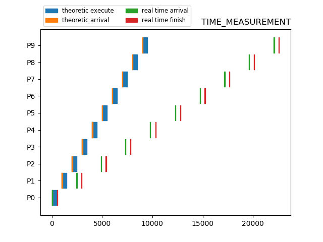

觀察到偏移原因是因為儘管都是500unit time，scheduler中的idle time和每個task中的執行時間會有差別，因此應該拿包含idle time的時間去平均，會得到$0.0012017508807935214$ s/unit_time。繪製成下圖。

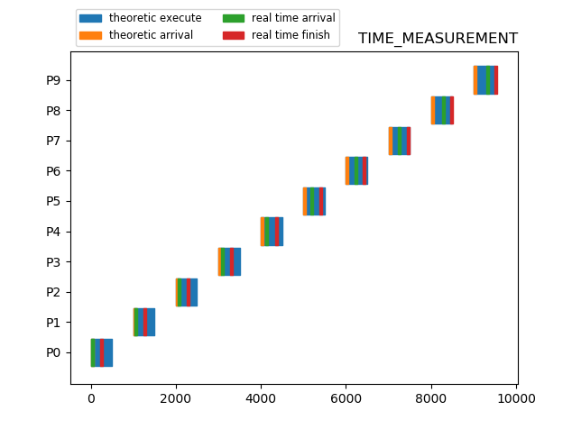

#### FIFO

| 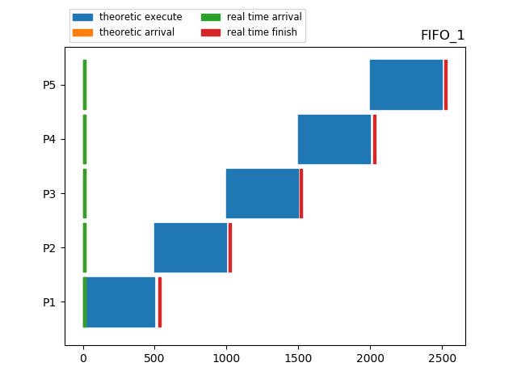 | 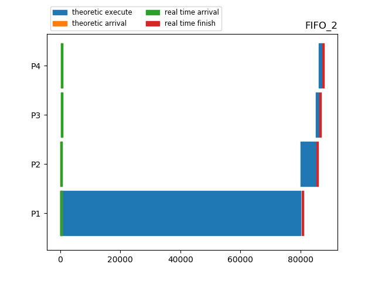 |
| ------------------- | ------------------- |
| 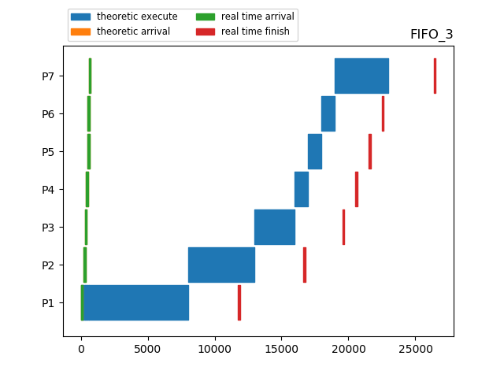 | 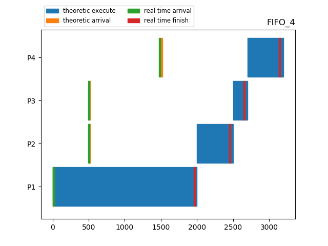 |
| 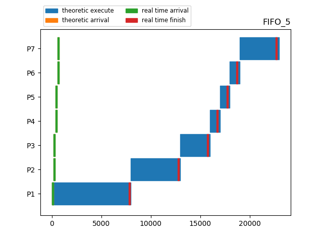 |                     |

#### SJF

| 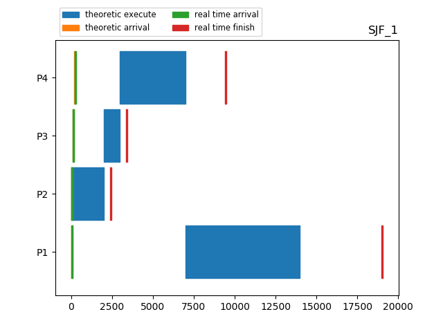 | 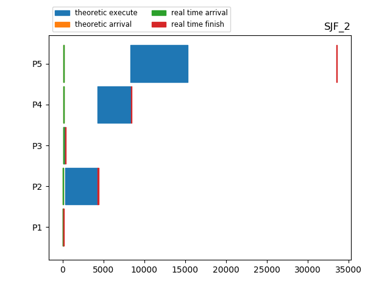 |
| ------------------- | ------------------- |
| 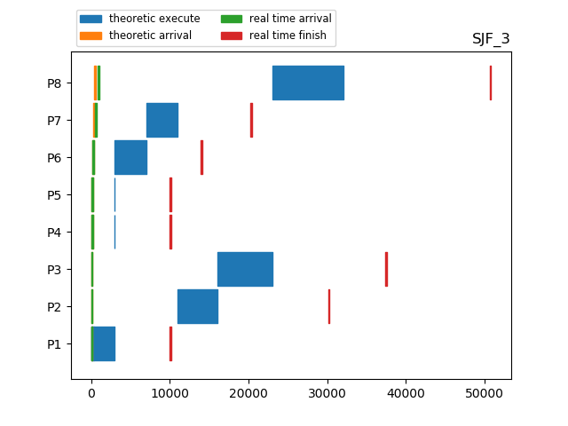 | 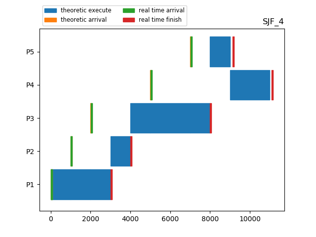 |
| 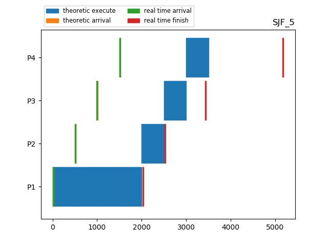 |                     |

#### PSJF

| 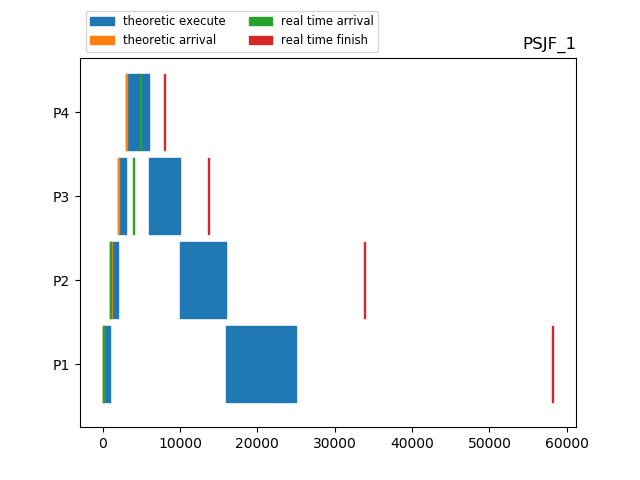 | 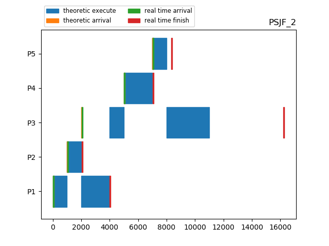 |
| ------------------- | ------------------- |
| 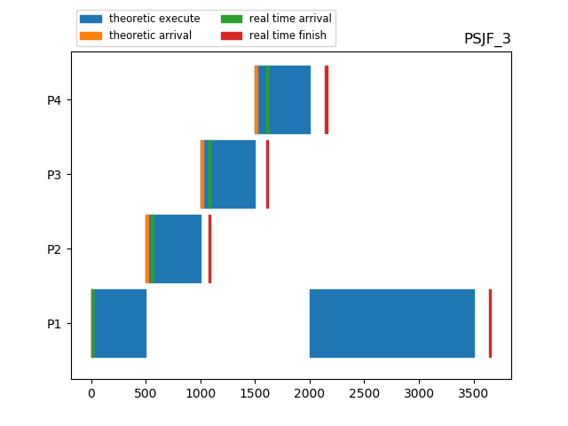 | 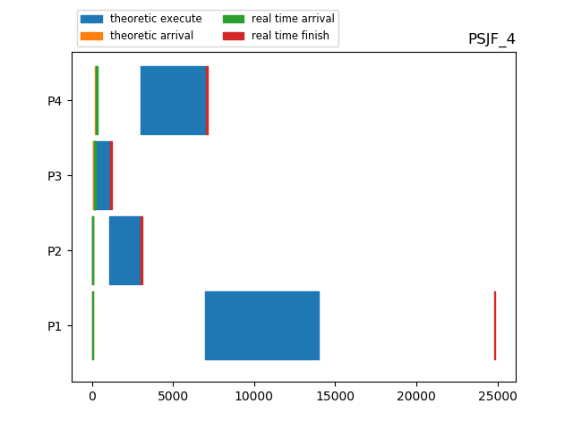 |
| 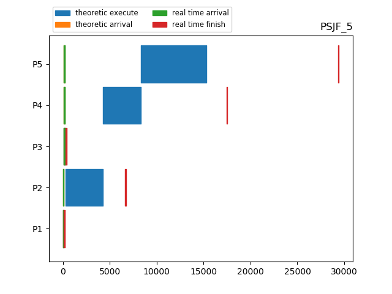 |                     |

#### RR

| 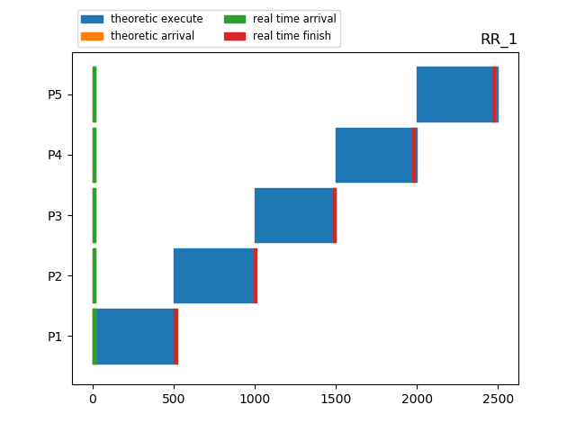 | 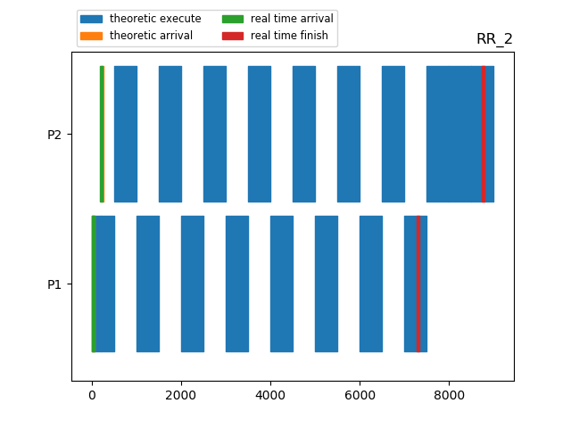 |
| ------------------- | ------------------- |
| 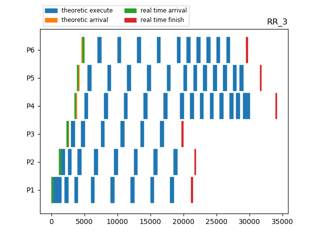 | 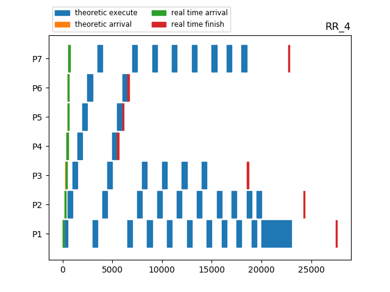 |
| 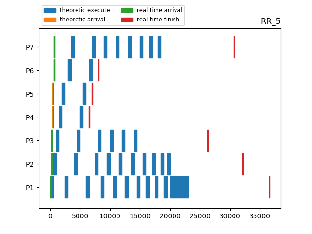 |                     |

### Analysis

實際結果的相對時間關係與理論的一致，但實際的執行時間會隨著整體時間的變長誤差越來越大，實際完成時間會比起理論完成時間晚更多。


可能的差異原因

* scheduler和task的時間單位會因為執行的process不同而不一致，儘管可以用pipe或signal的方式解決，但這就不符合作業的對於單位時間的定義了
* fork(), exec()及傳遞時間所需要的時間並沒有被計算在理論執行時間中，因此實際的執行時間會隨著整體時間的變長而變長是必然的
* 運行程式時的其他工作負載，比如瀏覽器或文字編輯器等，也可能會影響scheduler的運行
* CPU效率並不是一直固定的，會受到變頻的影響，或是不同的C state有不同的功耗，執行同樣task的時間也不盡相同

### Reference

Linux Man Page: https://linux.die.net/man/

The Linux Kernel Archive: https://www.kernel.org/

How to get to the GRUB menu at boot-time: https://askubuntu.com/questions/16042/how-to-get-to-the-grub-menu-at-boot-time